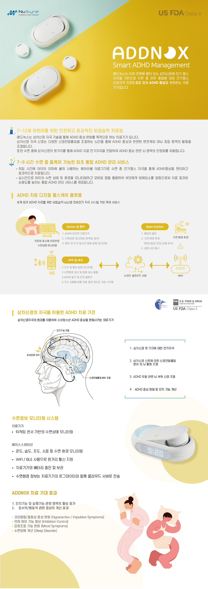

# **소개**

## **프로젝트 소개**
수면 중 특정 미세전류자극 프로토콜을 통해 이마부위 삼차신경을 자극하여 중추신경계의 활성을 조절하고,
ADHD 증상을 완화하는 치료기기입니다.

- **ADDNOX** 는 글로벌 마켓에 출시할 영문 버전입니다.
- **WITHNOX** 는 국내를 대상으로한 한국어 버전입니다.

자세한 정보는 [뉴아인 공식 홈페이지](https://nueyne.com/sub/product/product06.html)에서 확인할 수 있습니다.

