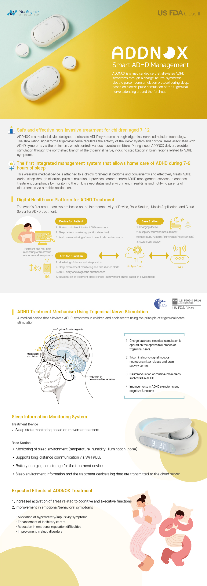

# **Introduction**

## **Project Overview**
This device is designed to alleviate ADHD symptoms by stimulating the trigeminal nerve on the forehead with a specific microcurrent protocol during sleep, helping to regulate central nervous system activity.

- **ADDNOX** is the English version intended for the global market.
- **WITHNOX** is the Korean version intended for the domestic market.

For more details, please visit the [official Nueyne website](https://nueyne.com/sub/product/product06.html).

